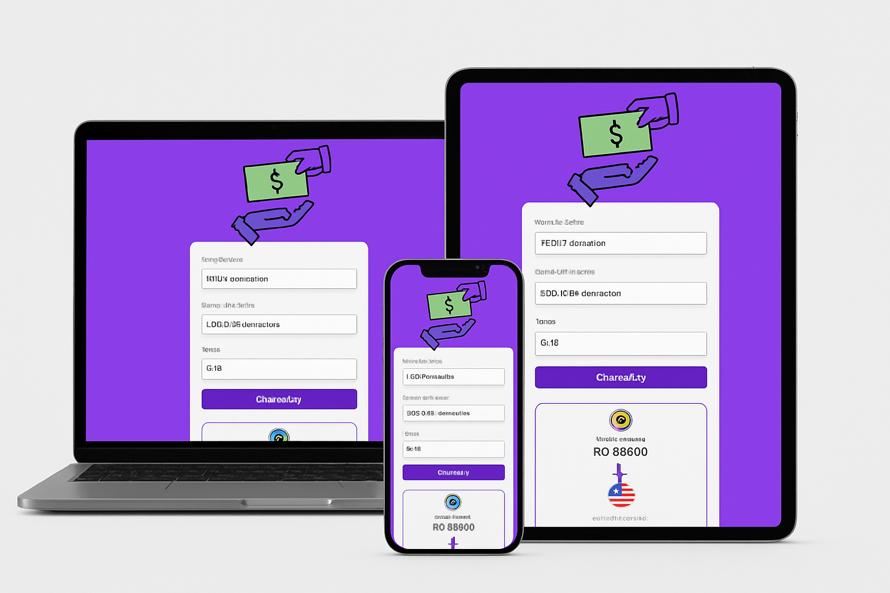

# 💱 Conversor de Moedas com API em Tempo Real

Um simples e funcional conversor de moedas feito com **HTML**, **CSS** e **JavaScript**, que utiliza a [AwesomeAPI](https://docs.awesomeapi.com.br/api-de-moedas) para buscar cotações atualizadas em tempo real.

## 🚀 Funcionalidades
- Conversão **de qualquer moeda para qualquer moeda** (BRL, USD, EUR, GBP).
- Exibição dinâmica de **bandeira**, **nome** e **valor formatado**.
- Cotações reais atualizadas automaticamente via API.
- Interface simples e responsiva.

## 📸 Demonstração
*(Adicione um print do seu projeto aqui)*  


## 🛠 Tecnologias Utilizadas
- **HTML5** – Estrutura da página.
- **CSS3** – Estilização e layout.
- **JavaScript (ES6+)** – Lógica de conversão e integração com API.
- **AwesomeAPI** – Fonte de cotações em tempo real.

## 📂 Estrutura de Pastas

## 🔧 Como Usar
1. Clone o repositório:
   ```bash
   git clone https://github.com/seuusuario/nome-do-repositorio.git
https://economia.awesomeapi.com.br/last/USD-BRL,EUR-BRL,GBP-BRL
